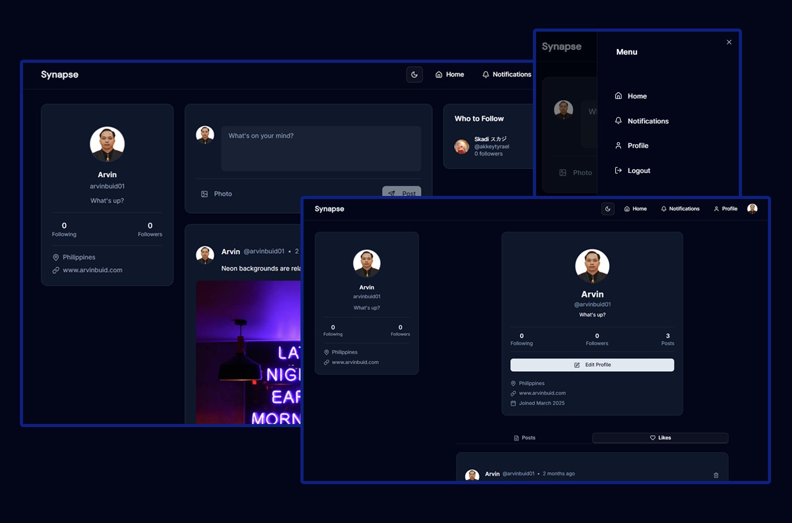

## Synapse

Fullstack social media web application made with NextJS 15 & modern web technologies.



### Features

- Post CRUD
- Authentication using Clerk
- Image upload
- Update Profile
- Real-time notifications
- Follow/Unfollow
- Dark/Light mode

### Usage:

#### Install npm dependencies

```bash
npm install
```

#### Add .env Variables

Rename the `.env.example` file to `.env` and add your database, clerk and uploadthing credentials.

```bash
NEXT_PUBLIC_CLERK_PUBLISHABLE_KEY=
CLERK_SECRET_KEY=

DATABASE_URL=

UPLOADTHING_TOKEN=
```

### Build for production

```bash
npm run build
```

### Run in development mode

```bash
npm run dev
```

Open [http://localhost:3000](http://localhost:3000) with your browser to see the result.

The project is now live in [https://synapse-six-sand.vercel.app](https://synapse-six-sand.vercel.app) for production view.
